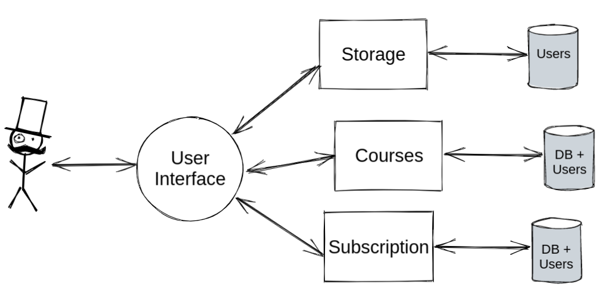
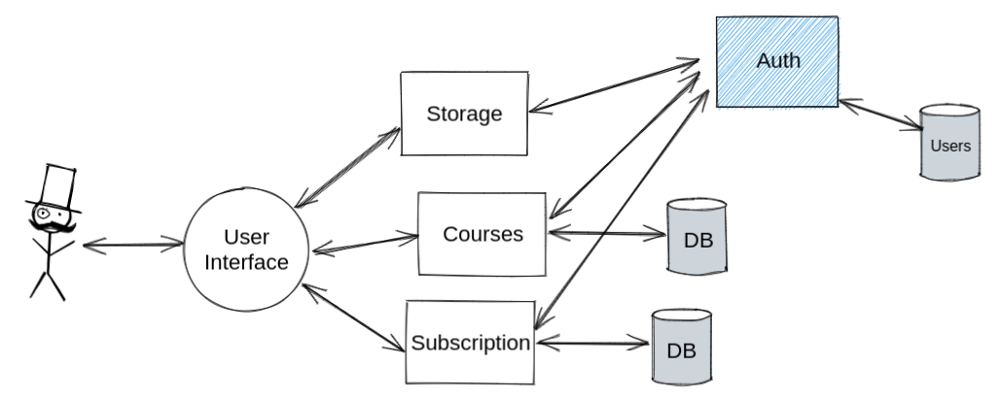
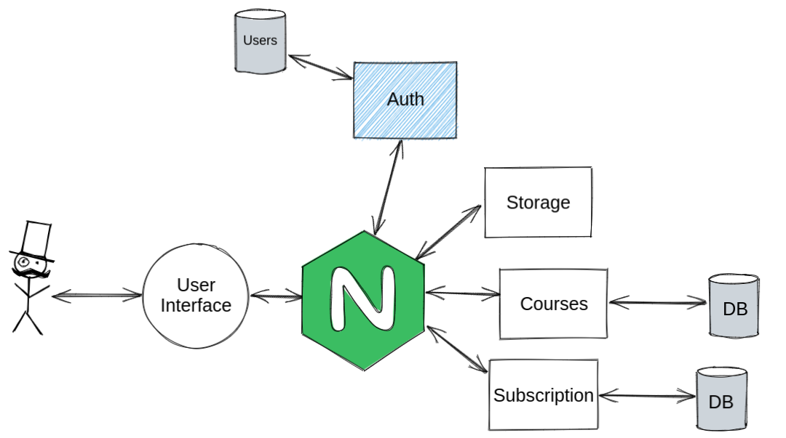

# ADR: Выбор структуры проекта

## Контекст и проблема

Я должен выбрать примерную структуру и вид проекта, который будет использовать микросервисы с возможностью функционально маршрутизировать запросы без объединения БД.

## Рассмотренные варианты
1. Аутентификация на каждом микросервисе

**Проблемы:**
 - Трудности при синхронизации БД
 - Не получится переиспользовать

2.Работа с пользователями в отдельном микросервисе

**Проблемы:**
 - Микросервисы не знаю какие запросы требуют аутентификации
 - Надо будет для всех сервисов реализовать взаимодействие с микросервисом Auth
## Решение
API Gateway

- Все запросы будут маршрутизироваться через nginx
- Запросы на микросервисы требующие авторзицаии будут перенаправлены в Auth, там получат токен и продолжать свой путь уже с необходимыми данными

## Итог
Выбрал реализацию через API Gateway